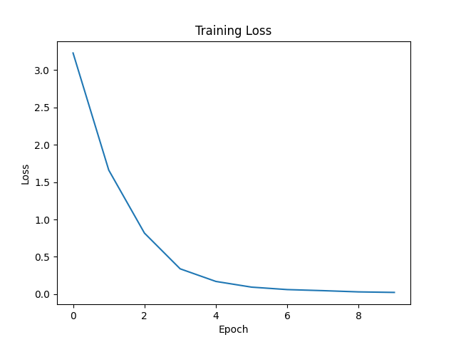

# Transformer

A PyTorch implementation of an encoder-decoder Transformer based on the paper *Attention Is All You Need* (Vaswani et al., 2017).

## Task 
Using this Transformer, we train a small English-to-Hebrew translation model on a synthetic dataset.
This task includes several linguistic challenges:

1. A single English verb can map to different Hebrew forms depending on the subject number, e.g. `see` -> `רואה` vs `רואים`.
2. In Hebrew, numbers and nouns have masculine and feminine forms and must agree, e.g. `שלושה חתולים` (masculine), `שלוש שמלות` (feminine).
3. In both languages, nouns appear in singular or plural form depending on the number in the sentence, e.g. `one cat` vs. `two cats`, `חתול אחד` vs `שני חתולים`.
4. In Hebrew, numbers usually appear before the noun (`שני חתולים`). However, for "one", the number appears after the noun, e.g. `חתול אחד`.
5. In English, verbs change form in third-person singular, e.g. `he sees` vs. `they see`.

## Code

```bash
pip install -r requirements.txt
```

```bash
python train.py
```

## Results
The model successfully learns the synthetic translation task and captures key grammatical rules, for example:

```text
i need six boats --> אני צריך שש סירות
you buy five cars --> אתה קונה חמש מכוניות
we request nine computers --> אנחנו מבקשים תשעה מחשבים
i see one cat --> אני רואה חתול אחד
we find one boat --> אנחנו מוצאים סירה אחת
you want two dresses --> אתה רוצה שתי שמלות
they like two books --> הם אוהבים שני ספרים
he needs three phones --> הוא צריך שלושה טלפונים
he loves four printers --> הוא אוהב ארבע מדפסות
```

## Learning Progress




At early stages of training, the model fails to capture some grammatical rules and often produces incorrect structures:

```text
i need six boats --> אני צריך שישה סירות  # wrong masculine number for a feminine noun
i see one cat --> אני רואה אחד  # missing noun
you love one cat  -->  אתה אוהב עץ אחד  # wrong noun
```
